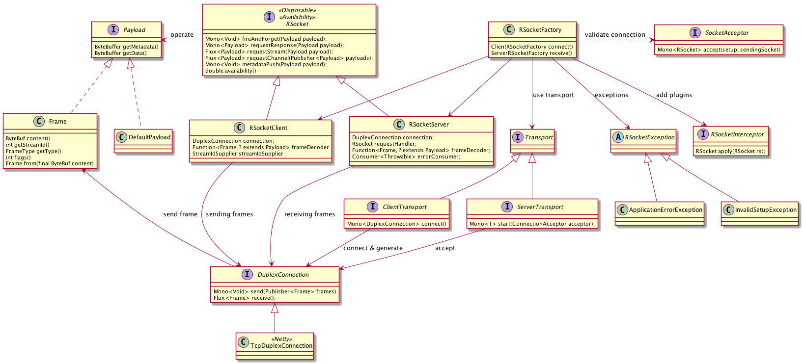

RSocket for spring boot
=======================

### How to use

* Create interface with Reactive support, for example

```
public interface UserService {
    Mono<User> findById(Integer id);
}
```

* Implement the service interface on the responder side, please add @RSocketService annotation
```
@RSocketService(serviceInterface = UserService.class)
public class UserServiceImpl implements UserService {
    @Override
    public Mono<User> findById(Integer id) {
        return Mono.just(new User(1, "nick:" + id));
    }
}
```
* In the requester side, create proxy bean to call reactive service:
```
    @Bean(destroyMethod = "dispose")
    public RSocket rSocket() {
        return RSocketFactory
                .connect()
                .transport(TcpClientTransport.create("localhost", 42252))
                .start()
                .block();
    }

    @Bean
    public UserService userService(RSocket rSocket) {
        return (UserService) Proxy.newProxyInstance(
                UserService.class.getClassLoader(),
                new Class[]{UserService.class},
                new RSocketInvocationRequesterHandler(rSocket));
    }
```

* call the service API from requester side:
```
@RestController
public class PortalController {
    @Autowired
    UserService userService;

    @RequestMapping("/user")
    public Mono<User> user() {
        return userService.findById(1);
    }
}
```

### graceful shutdown

Just invoke spring boot shutdown.

### RSocket settings

* default port: 42252

### RPC

* metadata: routing(service + rpc) & attributes(content-type)
* data: arguments
* data en/decoding: pb(unary), hessian, json https://github.com/eishay/jvm-serializers/wiki
* void return means fireAndForget() with parameters
* Mono<Void> return type means you should deal the success result.
* no method overload(no methods with same name in one service)
* channel (bi-directional streams) could be implemented on different listen port by cloud event

### en/decoding

en/decoding strategy for data. now rsocket is based on connection only.

* metadata: encoding by [protobuf](rsocket-spring-boot-starter/src/main/proto/rsocket.proto) or  [json](rsocket-spring-boot-starter/src/main/proto/metadata.json)
* data: primitive data, pb, json, hessian etc

#####  serializers(en/decoding)

Please consider polyglot problem.

* json:
* protobuf: https://developers.google.cn/protocol-buffers/
* hessian: http://hessian.caucho.com/
* kryo: https://github.com/EsotericSoftware/kryo
* thrift: https://thrift.apache.org/
* avro: https://avro.apache.org/
* msgpack: https://msgpack.org/  redis, fluentd etc
* cbor: http://cbor.io/

Kotlin serialization supports JSON, Protobuf, CBOR by default.


##### Why encoding for primitive data type

* performance: fast and small
* ByteBuffer is friendly for Primitive data type

Primitive data type

* byte: 0
* char: 0
* short: 0
* int: 0
* long: 0L
* float: 0.0f
* double: 0.0d
* String: null
* boolean: false
* datetime: year, month, day, hour, minute, second, how about timezone(GMT 0) or timezone field?

### Performance

* fast en/decoding for arguments
* payload is small with good protocol: binary better
* protocol is easy to parse
* Reactive: :beer:  RSocket shipped by default


### Load Balance

* RSocketSupplier: supplier to supply Mono<RSocket>
* come back???

### Tips

* subscribe operation in ApplicationRunner: these runners will be called after SpringApplication has started

### Todo

* channel design: port or routing
* load balance
* metrics & tracing
* spring boot actuator for rsocket
* client cache for performance
* Kotlin
* pb encoding: Kotlin, protostuff, protoc compatible
* RSocket cluster with spring cloud, like @RSocketCluster
* Envoy + RSocket:  tcp proxy with health check & failover

### Questions

* load balance: registry, failover
* graceful shutdown
* grpc compatible: idl code generation, for example idl to dubbo
* Polyglot SDK for rsocket
* rdma socket: transport adapter
* service mesh: sidecar proxy, Envoy

### References



* RSocket: http://rsocket.io/
* Reactor: http://projectreactor.io/
* RSocket Protocol: https://github.com/rsocket/rsocket/blob/master/Protocol.md
* HTTP/2 Protocol: https://httpwg.org/specs/rfc7540.html
* RSocket demo on SpringOne: https://github.com/netifi/springone-demo